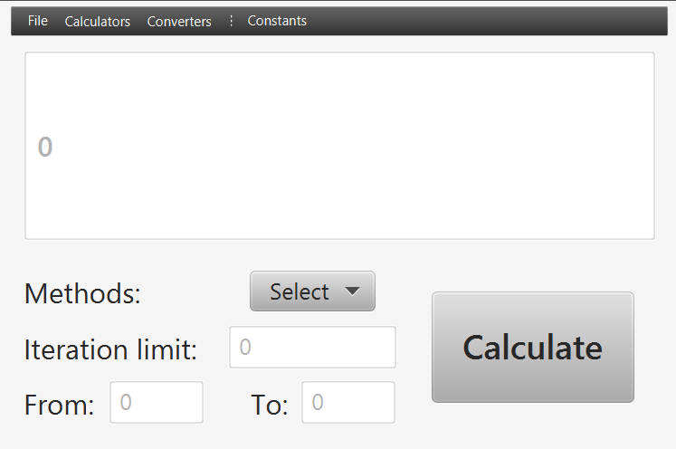
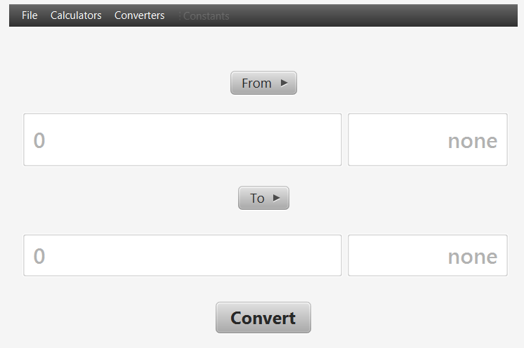

# Funkcionális specifikáció  

### A rendszer céljai és nem céljai (Ádám)

A program fő célja, hogy az erediteleg megrendelt program hibáit kijavítsa és a hiányzó elemeket pótolja. Az legfontosabb feladat, hogy a magas szintű tudományos kiállítás minőségi feltételeinek megfeleljen a program. Ehez az első lépés, hogy kijavítsuk a számológép hibás tokenizer-ét és parser-ét és a számítási pontoatlanságot. A második célja, hogy a mérleghez is javítsunk a lebegőpontos számokkal végzett műveleteket, hogy a program minőségén javítsunk. A harmadik lépés, hogy a randomszámgenerátor is megfelelően működjön. Összefoglalva a program célja, hogy megfeleljen a feltételeknek és, hogy pontos adatokkal támassza alá a tudományos munkát. Nem célja, hogy a program alapvető funkionaltásaiba nyúljon bele, csak, hogy a hibákat kijavítva egy megfelelő felhasználói élményeket nyújtson, ezzel is egy hatalmas poblémát megoldva napjaink tudományaiban.

---

### Jelenlegi helyzet leírása (Tamás)
Egy kiállításszervező cég ügyfele tudományos kiállítás szeretne rendezni, az igényelt szoftvereiket már megírta egy cég, viszont a kommunikáció teljes hiánya miatt az elkészült termékek nagyrésze használhatatlan vagy korlátolt működésben.  
Felkértek minket ezen szoftverek javítására, illetve új programok megírására amennyiben a javítás adott szoftver esetén nem lehetséges.    
A szoftvereket speciális hardverekre szánják, például egy __*nanogépekkel működő univerzális mérlegre*__, nekünk ezt nem kell figyelembe venni, mert ezekre az architektúrákra implementálva van a Java Virtuális Gép.     
A szoftverek jelenleg adatokat mentenek a lemezre.    
A korlátolt működés legfőbbképpen a lebegőpontos aritmetika pontatlanságában mutatkozik meg, de panaszkodnak a kapott forráskódok tesztelhetőségére is.   
A megrendelés 3 szoftverre szól, ezeknek speciális hibáik a következőek:
1. **OCR számológép**:
    * Hibás tokenizer és parser
    * Hibás kifejezéskiértékelés
    * Aritmetikai pontatlanság
2. **Nanogépekkel működő univerzális mérleg**:
    * Aritmetikai pontatlanság ami bevételkiesést jelent hosszútávon a termék felhasználóinak(gazdasági szereplők)
3. **Valódi randomszámegenerátor részmodulja**:
    * Aritmetikai pontatlanság
    * Párhuzamosítás teljes hiánya

---

### Vágyálom rendszer leírása (Tamás)

Legfőbb elvárásuk, hogy helyes működsére bírjuk a hibás szoftvertermékeket.      
Kérnek egy **PoC** programot is amivel egyszerűen tesztelhetik kézileg és __programmatically__ a funkcionalitásokat.      

A kód minősége __*nagyon*__ fontos számukra, elvárják olyan modern szoftverfejlesztést könnyítő könyvtárak használatát, mint például a boiler kódokat automatikus megíró **Lombok** könyvtárét.        
Szeretnék, hogy a programok ne egyszerűen egy szimpla fájlba rögzítsét a számítások eredményeit hanem egy adatbázisba.    

* Az adatbázist ők üzemeltetik, de szükségük van a relációkat elkészítő SQL szkriptekre     

* A fejlesztés alatt tetszőleges adatbázist használhatunk, ez mi esetünkben most a **h2** adatbázis lesz egyszerűsége miatt.    

Cross-platform elvárás miatt a Java platformra kell megírnunk a forráskódot, illetve a Maven build rendszert kell használnunk a projekthez, mivel ők is ezt használják cégen belül.    

Kimondott fejlesztések:
1. **OCR számológép**:
    * Tokenizer
    * Parser
    * Kifejezéskiértékelés környezetfüggetlen grammatikával
        * Double típus pontásságával dolgozhatunk
    * Adatbázisba való mentés
    
2. **Nanogépekkel működő univerzális mérleg**:
    * Függetlenség az aritmetikai pontosságra nézve az __*Apfloat*__ könyvtár használatával
    * Átváltás különböző mértékek között
    * Adatbázisba való mentés
3. **Valódi randomszámegenerátor részmodulja**:
     * Függetlenség az aritmetikai pontosságra nézve az __*Apfloat*__ könyvtár használatával
    * Algoritmusok párhuzamosítása
    * Adatbázisba való mentés

Kérnek ezenkívül **Markdown** formátumban dokumentált, **JUnit** keretrendszerrel történő egység tesztelést is a projekre.

---

### Jelenlegi üzleti folyamatok modellje (Ádám)

1. Windows számológép használata
	- Felhasználó betölti a Windows NT Kernelt => shell => userspace => megnyitja a Számológépet
	- Alapvető támogatott műveleteket használja
2. GNU/Linux számológép használata
	- Felhasználó betölti a Linux kernelt => shell => userspace
	- AKtuálisan elérhető számológépet használja
3. A felhasználó egy Online számológépet használ
	- Nem egységes számológép
	- Különböző bonyolultabb matematikai műveletek használata
4. A felhasználó online mértékegység átváltót használ
	- Nem megfelelő pontossággal számol
	- Különböző forrásokat használnak
	- Nem egységes felület
	- Csak Online felületek vannak
5. Rendelt program hibái
	- Esetekben előfordulnak nem működő funkciók
	- Az alkalmazás megbízhatatlan gyakran hiba türténik egyszerű számolásoknál is
	- Lebegőpontos számoknál hibás műveletek
	- Nem minden igényelt műveletet tartalmaz

---

### Igényelt üzleti folyamatok modellje (Dóra)

1. A számológépen belül többfajta számológép, illetve konvertáló érhető el:
    1. Alap (Basic) számológép:
        * Alap matematikai műveleteket támogat
            - Az alapműveletek a numerikus billentyűzet közvetlen közelében vannak elhelyezve
        * Haladó matematikai koncepciókat támogat
            - Konverziók, trigonometriai függvények, híres konstansok ...
            - A funkciók típus szerint vannak csoportosítva, a műveletek könnyebb megtalálása érdekében
    2. Haladó (Advanced) számológép
        * Kinézetre hasonló, mint az alap számológép, plusz funkciókat kielégítő gombbal van kiegészítve
        * Alap matematikai műveleteket támogat
            - Az alapműveletek a numerikus billentyűzet közvetlen közelében vannak elhelyezve
        * Haladó matematikai koncepciókat támogat
            - Konverziók, trigonometriai függvények, híres konstansok ...
            - A funkciók típus szerint vannak csoportosítva, a műveletek könnyebb megtalálása érdekében
        * Matematikai kifejezések megadását támogatja
            - Zárojelezésre alkalmas gombok is vannak erre a célra, melyek segítenek a kifejezések megadásában
            - A számológép tudja kezelni a kijezéseket
            - A számológép logikája ismeri a műveletek helyes kiértékelési sorrendjét (a műveletek prioritása)
    3. PI számológép
        * Támogatja a következő formulákat:
            - Chudnovsky, Zeta, Ramahujan, Leibniz
            - ezek mindegyike decimálisan számol, lényegük hogy egyik pontosabb mint a másik
        * BPP: Intervallumot lehet megadni, hogy a felhasználó adott számjegytől meddig akarja kiszámolni a hexajegyket
    4. Térfogat/Űrtartalom (Volume) konvertáló
        * A számológép támogatja a következő mértékegységeket és az átváltást köztük:
            - A liter alapmértékegységet, ennek törtrészeit és többszöröseit
            - A köbméter alapmértékegységet, ennek törtrészeit és többszöröseit
            - Híres mértékegységek (cups, teaspoons, gallon ...)  *[elhanyagolható]*
        * Egy listából lehet kiválasztani azt, hogy milyen mértékegységből szeretnénk átalakítani milyen mértékegységbe
    5. Hosszúség (Length) konvertáló    
        * A számológép támogatja a következő mértékegységeket és az átváltást köztük:
            - A méter alapmértékegységet, ennek törtrészeit és többszöröseit
            - A négyzetméter alapmértékegységet, ennek törtrészeit és többszöröseit
            - Híres mértékegységek (inch, feet ...)  *[elhanyagolható]*
        * Egy listából lehet kiválasztani azt, hogy milyen mértékegységből szeretnénk átalakítani milyen mértékegységbe
    6. Tömeg (Weight) konvertáló
        * A számológép támogatja a következő mértékegységeket és az átváltást köztük:
            - A kilogramm alapmértékegységet, ennek törtrészeit és többszöröseit
            - Híres mértékegységek (pounds ...)  *[elhanyagolható]*
        * Egy listából lehet kiválasztani azt, hogy milyen mértékegységből szeretnénk átalakítani milyen mértékegységbe
     7. Hőmérséklet (Temperature) konvertáló
        * A számológép támogatja a következő mértékegységeket és az átváltást köztük:
            - Celsius
            - Kelvin
            - Fahrenheit
        * Egy listából lehet kiválasztani azt, hogy milyen mértékegységből szeretnénk átalakítani milyen mértékegységbe

2. Mindegyik számológép típushoz tartozik egy saját scene

3. A menubar-ban egy menu-ben vannak felsorolva menu item-ekként az egyes számológépek és konvertálók, a felhasználó itt tudja kivélasztani, hogy éppen melyik számológépet akarja használni

4. Támogatja a History (Előzmény) módot
    - Az elvégzett számítások lementódnek
    - Az eddigi számításokat vissza lehet nézni / ki lehet listázni, a History gomb megnyomásával
    - Átlátható, az egyes műveletek nem folynak össze 

---

### Követelménylista (Dóra)

- K01. Könnyen üzemeltethetőség
- K02. Reszponzív GUI
- K03. Java
- K04. Cross-Platform
- K05. Előzmény mód
- K06. Matematikai alapműveletek
- K07. Matematikai haladó műveletek
- K08. Matematikai kifejezések kiértékelése
- K09. PI számológép
- K10. Térfogat/Űrtartalom konvertáló
- K11. Hosszúség (Length) konvertáló
- K12. Tömeg (Weight) konvertáló
- K13. Hőmérséklet (Temperature) konvertáló

---

### Használati esetek [Use cases] (Tamás)

---

### Képernyő tervek (Dóra)

1. Alap (Basic) számológép 

2. Haladó (Advanced) számológép

3. PI számológép

4. Térfogat/Űrtartalom (Volume) / Hosszúség (Length) / Tömeg (Weight) / Hőmérséklet (Temperature) konvertáló

Mindegyik konvertáló esetén a *From* és a *To* legördülő lista más menü elemeket tartalmaz, ami a képernyőterven most nem látszik.

---

### Fogalomszótár (Közös)

* **Előzmény (History) mód**: A korábban elvégzett műveletek listája/táblázata.
* **Cross-Platform**: Másnéven platformfüggetlenség, mely olyan operációs rendszerekre, programozási nyelvekre vagy számítógépes programokra, szoftverekre és implementációikra vonatkozik, amelyek több számítógépes platformon képesek mülködni. 
* **Platform**: Olyan hardver- és/vagy szoftverkörnyezet, mely meghatározza, hogy az adott számítógépen milyen más programok használhatók.

