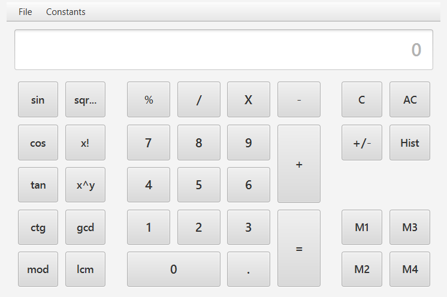
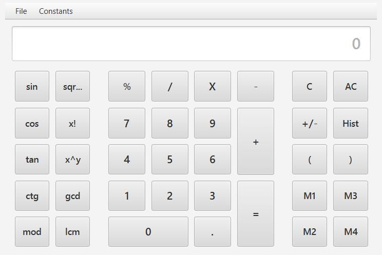

# Funkcionális specifikáció  

### A rendszer céljai és nem céljai (Ádám)

---

### Jelenlegi helyzet leírása (Tamás)

---

### Vágyálom rendszer leírása (Tamás)

---

### Jelenlegi üzleti folyamatok modellje (Ádám)

---

### Igényelt üzleti folyamatok modellje (Dóra)

1. A számológépen belül többfajta számológép, illetve konvertáló érhető el:
    1. Alap (Basic) számológép:
        * Alap matematikai műveleteket támogat
            - Az alapműveletek a numerikus billentyűzet közvetlen közelében vannak elhelyezve
        * Haladó matematikai koncepciókat támogat
            - Konverziók, trigonometriai függvények, híres konstansok ...
            - A funkciók típus szerint vannak csoportosítva, a műveletek könnyebb megtalálása érdekében
    2. Haladó (Advanced) számológép:
        * Kinézetre hasonló, mint az alap számológép, plusz funkciókat kielégítő gombbal van kiegészítve
        * Alap matematikai műveleteket támogat
            - Az alapműveletek a numerikus billentyűzet közvetlen közelében vannak elhelyezve
        * Haladó matematikai koncepciókat támogat
            - Konverziók, trigonometriai függvények, híres konstansok ...
            - A funkciók típus szerint vannak csoportosítva, a műveletek könnyebb megtalálása érdekében
        * Matematikai kifejezések megadását támogatja
            - Zárojelezésre alkalmas gombok is vannak erre a célra, melyek segítenek a kifejezések megadásában
            - A számológép tudja kezelni a kijezéseket
            - A számológép logikája ismeri a műveletek helyes kiértékelési sorrendjét (a műveletek prioritása)
    3. Térfogat/Űrtartalom (Volume) konvertáló
        * A számológép támogatja a következő mértékegységeket és az átváltást köztük:
            - A liter alapmértékegységet, ennek törtrészeit és többszöröseit
            - A köbméter alapmértékegységet, ennek törtrészeit és többszöröseit
            - Híres mértékegységek (cups, teaspoons, gallon ...)  *[elhanyagolható]*
        * Egy listából lehet kiválasztani azt, hogy milyen mértékegységből szeretnénk átalakítani milyen mértékegységbe
    4. Hosszúség (Length) konvertáló    
        * A számológép támogatja a következő mértékegységeket és az átváltást köztük:
            - A méter alapmértékegységet, ennek törtrészeit és többszöröseit
            - A négyzetméter alapmértékegységet, ennek törtrészeit és többszöröseit
            - Híres mértékegységek (inch, feet ...)  *[elhanyagolható]*
        * Egy listából lehet kiválasztani azt, hogy milyen mértékegységből szeretnénk átalakítani milyen mértékegységbe
    5. Tömeg (Weight) konvertáló
        * A számológép támogatja a következő mértékegységeket és az átváltást köztük:
            - A kilogramm alapmértékegységet, ennek törtrészeit és többszöröseit
            - Híres mértékegységek (pounds ...)  *[elhanyagolható]*
        * Egy listából lehet kiválasztani azt, hogy milyen mértékegységből szeretnénk átalakítani milyen mértékegységbe
     6. Hőmérséklet (Temperature) konvertáló
        * A számológép támogatja a következő mértékegységeket és az átváltást köztük:
            - Celsius
            - Kelvin
            - Fahrenheit
        * Egy listából lehet kiválasztani azt, hogy milyen mértékegységből szeretnénk átalakítani milyen mértékegységbe

2. Mindegyik számológép típushoz tartozik egy saját scene

3. A menubar-ban egy menu-ben vannak felsorolva menu item-ekként az egyes számológépek és konvertálók, a felhasználó itt tudja kivélasztani, hogy éppen melyik számológépet akarja használni

4. Támogatja a History (Előzmény) módot
    - Az elvégzett számítások lementódnek
    - Az eddigi számításokat vissza lehet nézni / ki lehet listázni, a History gomb megnyomásával
    - Átlátható, az egyes műveletek nem folynak össze 

---

### Követelménylista (Dóra)

- K01. Könnyen üzemeltethetőség
- K02. Reszponzív GUI
- K03. Java
- K04. Cross-Platform
- K05. Előzmény mód
- K06. Matematikai alapműveletek
- K07. Matematikai haladó műveletek
- K08. Matematikai kifejezések kiértékelése
- K09. Térfogat/Űrtartalom konvertáló
- K10. Hosszúség (Length) konvertáló
- K11. Tömeg (Weight) konvertáló
- K12. Hőmérséklet (Temperature) konvertáló

---

### Használati esetek [Use cases] (Tamás)

---

### Képernyő tervek (Dóra)

1. Alap (Basic) számológép 

2. Haladó (Advanced) számológép

---

### Fogalomszótár (Közös)

* **Előzmény (History) mód**: A korábban elvégzett műveletek listája/táblázata.
* **Cross-Platform**: Másnéven platformfüggetlenség, mely olyan operációs rendszerekre, programozási nyelvekre vagy számítógépes programokra, szoftverekre és implementációikra vonatkozik, amelyek több számítógépes platformon képesek mülködni. 
* **Platform**: Olyan hardver- és/vagy szoftverkörnyezet, mely meghatározza, hogy az adott számítógépen milyen más programok használhatók.

