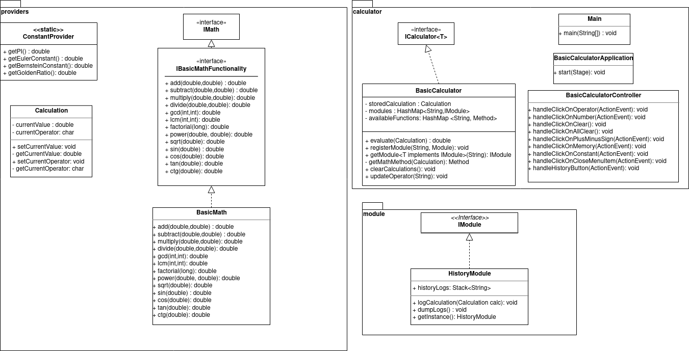
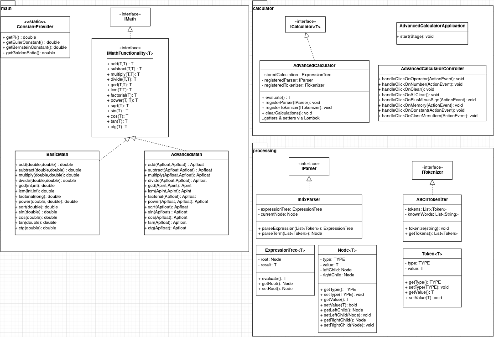
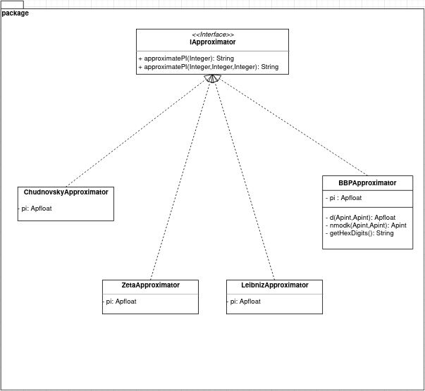
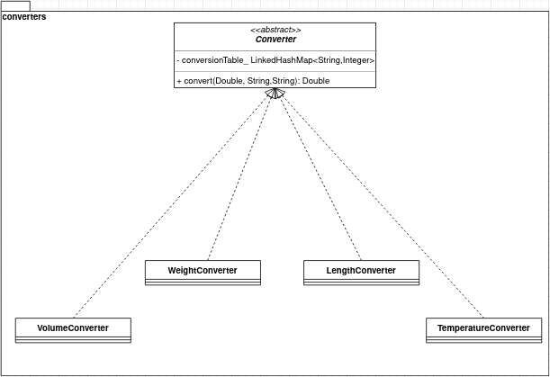
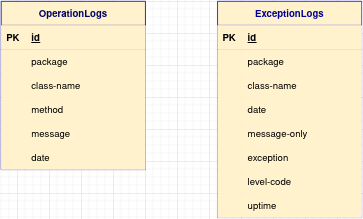

# Rendszerterv


### A rendszer célja (Ádám)

A program fő célja, hogy az erediteleg megrendelt program hibáinak kijavítását és a hiányzó elemek pótolását demonstrálja.      
A legfontosabb feladat, hogy a magas szintű tudományos kiállítás minőségi feltételeinek megfeleljenek a kért algoritmusok.     
Ehhez az első lépés, hogy kijavítsuk a számológép hibás tokenizer-ét és parser-ét és a számítási pontatlanságát.     
A második célja, hogy a mérleghez készült szoftveren is javítsunk a lebegőpontos számokkal végzett műveleteket, hogy a algoritmus minőségén javítsunk.     
A harmadik lépés, hogy a randomszámgenerátor részmodulja is megfelelően működjön.     

Összefoglalva a program célja, hogy megfeleljen a feltételeknek és, hogy pontos adatokkal támassza alá a tudományos funkcionalitást. Nem célja, hogy a program alapvető funkionaltásaiba nyúljon bele, csak, hogy a hibákat kijavítva a megfelelő működést és kapcsolódó élményeket nyújtson.   


---


### Projekt terv (Ádám)

1. Projekt szerepkörök, felelősségei:
	- A projekt szerepkörök felosztása egyenlően van felosztva a csapatunk tagjai között
	- Minden tagnak saját felelőssége, hogy az általa írt kód részlet megfelelően működjön

2. Projektmunkások és felelősségeik:
	- A projekten dolgozó emberek György Dóra, Racs Tamás és Pallagi Ádám
	- Minden tag felelős a munkája minőségéért
	
3. Ütemterv:
	- A munka elvégzésére 7 hét áll rendelkezésre
	- A projekt 3 nagy részre bontható minden részre 2 hét idő áll rendelkezésre
	- Az utolsó héten a projekt tesztelése történik

4. Mérföldkövek:
	- Advanced Calculator létrehozása
	- PI Calulcator létrehozása
	- Térfogat/Űrtartalom Calculator létrehozása
	- Tesztelés elvégzése

---


### Üzleti folyamatok modellje
1. Üzleti szereplők
   * Ügyfél ügyfelének munkatársai
   * Kiállítás résztvevői
   * Kiállítás szervezői
   * A rendezvényben érdekelt illetékes hatóságok
   * Üzleti munkatársak:
        * Rendszergazdák
        * IT osztály tagjai
        * Fejlesztők
        * Adatbázis adminisztrátorok

2. Üzleti folyamatok
    * Tanítás, oktatás
    * Számítások elvégzése
    * Könyvelés
    * Naplózás
    * Optikai karakterfeldolgozás
    * Adatbázis elérés
    * PI megközelítése
    * Mérések különböző szenzorok segítségével
    * Karbantartás
    * Üzemeltetés    
    * Szoftverek elérhetőségének biztosítása

3. Üzleti entitások
    * Operációs rendszerek
    * Internet
    * Intézmény
    * Kiálltásszervezők
    * Kiállítás
    * Adatbázis
    * Tárhely
    * Rendszergazdai csoport
    * Fejlesztői csapat(ok)
---


### Követelmények (Dóra)

1. Alap (Basic) számológép
    - Alap műveletek végrehajtása
        * művelet végrehajtásának a menete: operandus megadása -> művelethez szükséges operátor -> újabb operandus -> egyenlő operátor -> az eredmény megjelenik a kijelzőn
        * összetettebb műveletsorok elvégzése is lehetséges, ekkor az egyenlő operátor helyett újabb alap műveletet jelölő operátor jön, majd újabb operandus. A műveletsor végén, ha már nem akarunk újabb műveleteket elvégezni, akkor az egyenlő operátor megnyomásával lezárjuk a műveletsort és megjelenítjük az eredmény.
    - Haladó matekatikai koncepciók végrehajtása
        * művelet végrehajtásának a menete: operandus megadása -> a művelethez szükséges operátor -> az eredmény autómatikusan megjelenik a kijelzőn, anélkül, hogy megnyomnánk az egyenlő operátort.
        * műveletsorok elvégzése közben is használhóak ezek a funkciók.
2. Haladó (Advanced) számológép
    - Alap műveletek végrehajtása
        * művelet végrehajtásának a menete: operandus megadása -> művelethez szükséges operátor -> újabb operandus -> egyenlő operátor -> az eredmény megjelenik a kijelzőn
        * összetettebb műveletsorok elvégzése is lehetséges, ekkor az egyenlő operátor helyett újabb alap műveletet jelölő operátor jön, majd újabb operandus. A műveletsor végén, ha már nem akarunk újabb műveleteket elvégezni, akkor az egyenlő operátor megnyomásával lezárjuk a műveletsort és megjelenítjük az eredmény.
    - Haladó matekatikai koncepciók végrehajtása
        * művelet végrehajtásának a menete: operandus megadása -> a művelethez szükséges operátor -> az eredmény autómatikusan megjelenik a kijelzőn, anélkül, hogy megnyomnánk az egyenlő operátort.
        * műveletsorok elvégzése közben is használhóak ezek a funkciók.
    - Öszetett matematikai kifejezések végrehajtása:
        * művelet végrehajtásának a menete: zárójelek, operandusok és operátorok segítéségével megadni a matematikai kifejezést -> egyenló operátor -> az ifejezés eredménye megjelenik a kijelzőn.
3. PI számológép
    - művelet végrehajtásának a menete: ki kell választani hogy melyik módszert szeretnénk használni -> megadni a számításhoz szükséges paramétereket -> Calculate gomb megnyomása -> az eredmény megjelenik a képernyőn
4. Térfogat/Űrtartalom (Volume) konvertáló
    - művelet végrehajtásának a menete: kiválasztani hogy melyik mértékegységből szeretnénk konvertálni -> kiválasztani hogy melyik mértékegységbe szeretnénk konvertálni -> megadni a mennyiséget amit konvertálni szeretnénk -> Convert gomb megnyomása -> a konvertálás eredménye megjelenik a megfelelő cellában
    - a Convert gomb megnyomása előtti műveletek sorrendje felcserélhető
 5. Hosszúség (Length) konvertáló
    - művelet végrehajtásának a menete: kiválasztani hogy melyik mértékegységből szeretnénk konvertálni -> kiválasztani hogy melyik mértékegységbe szeretnénk konvertálni -> megadni a mennyiséget amit konvertálni szeretnénk -> Convert gomb megnyomása -> a konvertálás eredménye megjelenik a megfelelő cellában
    - a Convert gomb megnyomása előtti műveletek sorrendje felcserélhető
6. Tömeg (Weight) konvertáló
    - művelet végrehajtásának a menete: kiválasztani hogy melyik mértékegységből szeretnénk konvertálni -> kiválasztani hogy melyik mértékegységbe szeretnénk konvertálni -> megadni a mennyiséget amit konvertálni szeretnénk -> Convert gomb megnyomása -> a konvertálás eredménye megjelenik a megfelelő cellában
    - a Convert gomb megnyomása előtti műveletek sorrendje felcserélhető
7. Hőmérséklet (Temperature) konvertáló
    - művelet végrehajtásának a menete: kiválasztani hogy melyik mértékegységből szeretnénk konvertálni -> kiválasztani hogy melyik mértékegységbe szeretnénk konvertálni -> megadni a mennyiséget amit konvertálni szeretnénk -> Convert gomb megnyomása -> a konvertálás eredménye megjelenik a megfelelő cellában
    - a Convert gomb megnyomása előtti műveletek sorrendje felcserélhető
8. ELőzmény (History) mód használata
    - az elózmények előhívása nagyon egyszerű, a "Hist" gomb megnyomásával egy ablakban láthatóvá válnak az eddigi műveletek és eredményeik
    - az egyes műveletek egymástól jól elkülönítve láthatóak
    - az előzmények között csak azok a műveletek láthatóak, amelyek a program elindítása óta lettek elvégezve, a program bezárásával az előzmények is eltünnek.
    - csak az alap és a haladó számológép esetén hívható elő


--- 


### Funkcionális terv
A funkcionális specifikációban leírt használati esetek alapján kell ejárnunk.   
Implementációs segítségét a Class Diagram és a Database Scheme fog nyújtani.    

## **BasicCalculator esetén a következőket mondhatjuk el:**

A matematikai függvényeket, beleértve az alapműveleteket, saját osztályaink alapján fogjuk szolgáltatni.   
A rendszer főbb osztályai:   
* _BasicCalculator_ osztály:
    * Nyomonköveti egy tagváltozóban az aktuális részeredményt
    * A "Controller" osztályban példányosodik
    * Nyomonköveti az aktuálisan alkalmazandó operátort is  
        * Ha nincs mentve jelenleg, akkor mentés kijelzőről + operátor maga
        * Ha van mentve, akkor részkiértékelés
* _BasicMath_ osztály:
    * Implementálja az _IBasicMathFunctionality_ interfészt
    * Wrapper a StrictMath-ra nézve
* _Calculation_ osztály:
    * Data class
    * Hordozza az operátort és (egyik) operanduszát            
* _ConstantProvider_ osztály:
    * Statikus osztály, nem példányosítható
    * Statikus függvények révén ad vissza definiált konstans értékeket    
* _HistoryModule_ osztály:
    * Singleton osztály
    * Minden részkiértékelés eredménye rögzítésre kerül ```logCalculation(Calculation c)``` metódusa révén
    * Biztosítja a Történelem funkciót
    * Module Interfészből ered
* _BasiCalculatorApplication_ osztály:
    * Lényegében a Main()-t definiáló osztály, _Controller_
    * Itt történik az FXML betöltése     
    * FXML Contoljainak bekötése..   
* _BasicCalculatorController_ osztály:
    * Az MVC modelben ő valósítja meg a Controllert
    * Összeköti a View és Modellt



## **AdvancedCalculator esetén a következőket mondhatjuk el:**  
Azonos az architekturális a **BasicCalculator** programmal, viszont bővel egy _Tokenizer_ és _Parser_ osztállyal egy új csomagban.   

A _Tokenizer_ osztály:
* A bemenetet karakterenként olvassa _Token_-eket állít elő
* Az előállított _Token_-eket olvasási sorrendet megtartva kerül átadásra a _Parser_ példánynak
* Hibát dob ismeretlen bemenet esetén
_Token_ osztály:     
* Érvényes matematikai kifejezést/utasítást reprezentáló osztály

_Parser_ osztály:
* Kapott tokensorozatot értékel ki a beprogramozott nyelvtani szabályok alapján
* Hibát dob szintaktikai hiba esetén



## **PICalculator esetén a következőket mondhatjuk el:**  
_IApproximator_ osztály:
* Interfész amit a PI-t közelítő osztályok implementálnak
(Chudnovsky, Zeta, BBP, Leibniz, ...)
* Mivel Javaban nem értelmezett az alapértelmezett paraméter megadása, overloadoljuk az `approximatePI` metódust    

_&lt;Approximator&gt;_ alosztályok:
* Implementálják az _IApproximator_ interfészt
* Az adott metódus alapján közelítik PI értékét decimális formában

_BBPApproximator_ osztály:
* Speciális közelítő
* A PI-nek hexadecimális számjegyeit határozza meg



## **Converter esetén a következőket mondhatjuk el:**      
_Converter_ absztrakt osztály:
* Absztrakt osztály amelyet az egyes _Converter_ alosztályok bővítenek
* Az átváltások egy _conversionTable_ nevű kulcstranszformációs táblázat alapján történik     
    * Ezek tartalma konstans, soha nem változhat
* _&lt;*Converter&gt;_  osztályok     
    * Az átváltásokat valósítják meg      




## **Adatbázis séma**      
Mivel az ügyfél saját adatbázist üzemeltet nem volt szükség túltervezni az általunk majd a fejlesztés és tesztelés folyamatok alatt használt adatbázissémát.   
A `tinylog` naplózó könyvtár konfigurációs állományra építve a következő szimpla, naplóbejegyzéseket tartalmazó adatbázist fogjuk létre hozni `h2` relációs adatbázisrendszerben:   



...
---


### Fizikai környezet (Dóra)

- Reszponzív megjelenés
- A program Java nyelven legyen írva, a fejlesztéshez és teszteléshez használt felületek, eszközök szabadon választhatóak
- A GUI JavaFX alapokon legyen, a számológép és a konverterek kinézete SceneBuilder használatával legyen összeállítva
- Az Előzmény mód nem igényel adatbázist, ezért nem szükséges annak üzemeltetése sem, az előzmények egy ablakban lesznek megjelenítve
- A program Windows, Mac OS illetve Linux operációs rendszereken egyaránt futtatható és használható

---


### Architekturális terv (Ádám)


---

### Tesztterv
Alapvetően a cél a kért forráskódok letesztelése a cél, nem konkrét célunk a hozzá készült PoC program alapos tesztelése, viszont mivel demonstrálásra szeretnék felhasználni muszáj tesztelnünk annak működését:
1. Vannak-e eseménykezelő metódusok rendelve az egyes Controllokhoz?
2. Helyes eseménykezelő hívódik-e meg adott Control esetében?
3. Ha egy Control több eseményét is kezeljük akkor a helyes eseménykezelő hívódik-e meg?
4. Átméretezhető az ablak?
5. Átméretezéskor követik a Control-ok a befoglaló Container arányait?
6. Az főablak bezárásakor ténylegesen megszakítódik a program?

A forráskódokat a megadott igények mentén kell tesztelnünk, ha ezek a tesztek sikeresen lefutnak akkor átadható az ügyfélnek az elkészült, javított forráskód.  

## **OCR hardver számológép esetében:**
1. A beírt, szintaktikailag helyes matematikai kfiejezést helyesen értékeli-e ki a kapcsolódó metódus?
2. Ha beírt, szintaktikailag helytelen kifejezést értékelünk ki akkor hibával tér-e vissza a metódus?
3. Ha beírt, szintaktikailag helyes de nem támogatott matematikai kfiejezést értékelünk ki akkor hibával tér-e vissza a kiértékelő metódus?
4. Használató-e más IAdvancedMath interfészt implementáló osztály-e?
5. A program helyesen naplózza az elvégzett műveleteket az adatbázisba?
6. A program megfelelő lebegőpontos aritmetikai pontosság mellett dolgozik?
7. A tokenizer dob-e hibát érvénytelen karakter feldolgozásakor?
8. A parser helyesen alkalmazza a nyelvtani szabályokat?


## **Nanógépes alapokon működő univerzális mérleg konverziós könyvtára esetében:**
1. A megadott és a kért mértékegységek között helyes-e az átváltás?   
2. Ugyanazt az eredményt kapjuk ha oda-vissza konvertálunk egy adott értéket?   
3. Dob-e hibát a könyvtár ha különböző mennyiségek közötti konverziót szeretnék elérni?
4. Dob-e kivételt a könyvtár ha ismeretlen mértékegyséről/re szeretnék konvertálni?
5. Dob-e kivételt a könyvtár ha érvénytelen értékét szeretnék átkonvertálni?
6. A program helyes naplózza az elvégzett műveleteket az adatbázisba?
7. A program megfelelő lebegőpontos aritmetikai pontosság mellett dolgozik?

## **PI részmodul esetében:**    
1. A program helyes naplózza az elvégzett műveleteket az adatbázisba?
2. A program megfelelő lebegőpontos aritmetikai pontosság mellett dolgozik?
3. BPP közelítés   
    * A kért hexadecimális számjegyeket kapjuk-e vissza?
    * A helyes hexadecimális számjegyeket kapjuk-e vissza?
    * Megfelelő-e a pontosság az adott iterációshatárnak megfelelően?
    * Valódi eredményt szolgáltat?
    * A párhuzamosság helyessége
4. A decimális közelítők helyes eredményt szolgáltatnak?
5. Megfelelően vannak-e párhuzamosítva a decimális közelítők?  
6. Dob-e kivételt a könyvtár helytelen paraméterek megadása esetén?


---


### Telepítési terv (Dóra)

- Linux operációs rendszeren
    * a számológép ikon általi indítása
    * a számológép parancssori futtatása

    ```
    git clone https://github.com/adampallagi/SZFM_2020_10_RGP.git 
    cd SZFM_2020_10_RGP/
    mvn package
    java -jar ./target/SZFM_2020_10_RGP-1.0.jar
    ```

- Windows operációs rendszeren:
    * a számológép ikon általi indítása
    * a számológép (PowerShell vagy Linux alapú terminálból való) parancssori futtatása 

    ```
    git clone https://github.com/adampallagi/SZFM_2020_10_RGP.git 
    cd SZFM_2020_10_RGP/
    mvn package
    java -jar ./target/SZFM_2020_10_RGP-1.0.jar
    ```

- MacOS operációs rendszeren:
    * a számológép ikon általi indítása
    * a számológép (Linux alapú terminálból való) parancssori futtatása 

    ```
    git clone https://github.com/adampallagi/SZFM_2020_10_RGP.git 
    cd SZFM_2020_10_RGP/
    mvn package
    java -jar ./target/SZFM_2020_10_RGP-1.0.jar
    ```


---


### Karbantartási terv (Dóra)

- A https://github.com/cant0r/SZFM_2020_10_RGP GitHub címen mindig a legújabb verzió lesz az elérhető
- Új verzió megjelenése esetén a megrendelőt, erről email-ben fogjuk majd értesíteni. Abban, hogy frissítik-e az alkalmazást vagy nem, szabad akaratuk szerint járnak el 
- A frissítés elvégzése mindig ajánlott, felmerülő problémák, hibák kijavított verziója és/vagy újdonságok lesznek elérhetőek benne.

