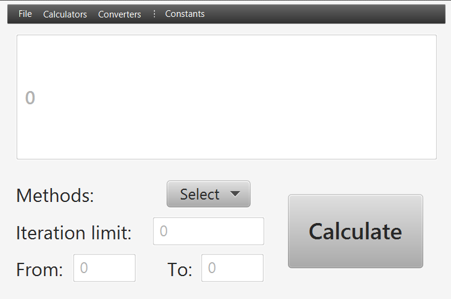

# Funkcionális specifikáció  

### A rendszer céljai és nem céljai

A program fő célja, hogy az erediteleg megrendelt program hibáinak kijavítását és a hiányzó elemek pótolását demonstrálja.      
A legfontosabb feladat, hogy a magas szintű tudományos kiállítás minőségi feltételeinek megfeleljenek a kért algoritmusok.     
Ehhez az első lépés, hogy elkészítsünk egy egyszerűsített számológépet, majd annak egy haladott változatát   
A második célja, hogy a mérleghez készült szoftveren is javítsunk a lebegőpontos számokkal végzett műveleteket, hogy a algoritmus minőségén javítsunk.     
A harmadik lépés, hogy a randomszámgenerátor részmodulja is megfelelően működjön.     

Összefoglalva a program célja, hogy megfeleljen a feltételeknek és, hogy pontos adatokkal támassza alá a tudományos funkcionalitást. Nem célja, hogy a program alapvető funkionaltásaiba nyúljon bele, csak, hogy a hibákat kijavítva a megfelelő működést és kapcsolódó élményeket nyújtson.   

---

### Jelenlegi helyzet leírása
Egy kiállításszervező cég ügyfele tudományos kiállítás szeretne rendezni, az igényelt szoftvereiket már megírta egy cég, viszont a kommunikáció teljes hiánya miatt az elkészült termékek nagyrésze használhatatlan vagy korlátolt működésben.  
Felkértek minket ezen szoftverek javítására, illetve új programok megírására amennyiben a javítás adott szoftver esetén nem lehetséges.    
A szoftvereket speciális hardverekre szánják, például egy __*nanogépekkel működő univerzális mérlegre*__, nekünk ezt nem kell figyelembe venni, mert ezekre az architektúrákra implementálva van a Java Virtuális Gép.     
A szoftverek jelenleg adatokat mentenek a lemezre.    
A korlátolt működés legfőbbképpen a lebegőpontos aritmetika pontatlanságában mutatkozik meg, de panaszkodnak a kapott forráskódok tesztelhetőségére is.   
A megrendelés 3 szoftverre szól, ezeknek speciális hibáik a következőek:
1. **Számológépek**:
    * Hibás kiértékelési sorrend
    * Hibás kifejezésértelmezés
    * Aritmetikai pontatlanság
2. **Nanogépekkel működő univerzális mérleg**:
    * Aritmetikai pontatlanság ami bevételkiesést jelent hosszútávon a termék felhasználóinak(gazdasági szereplők)
3. **Valódi randomszámegenerátor részmodulja**:
    * Aritmetikai pontatlanság
    * Párhuzamosítás teljes hiánya

---

### Vágyálom rendszer leírása

Legfőbb elvárásuk, hogy helyes működsére bírjuk a hibás szoftvertermékeket.      
Kérnek egy **PoC** programot is amivel egyszerűen tesztelhetik kézileg és __programmatically__ a funkcionalitásokat.      

A kód minősége __*nagyon*__ fontos számukra, elvárják olyan modern szoftverfejlesztést könnyítő könyvtárak használatát, mint például a boiler kódokat automatikus megíró **Lombok** könyvtárét.        
Szeretnék, hogy a programok ne egyszerűen egy szimpla fájlba rögzítsét a számítások eredményeit hanem egy adatbázisba.    

* Az adatbázist ők üzemeltetik, de szükségük van a relációkat elkészítő SQL szkriptekre     

* A fejlesztés alatt tetszőleges adatbázist használhatunk, ez mi esetünkben most a **h2** adatbázis lesz egyszerűsége miatt.    

Cross-platform elvárás miatt a Java platformra kell megírnunk a forráskódot, illetve a Maven build rendszert kell használnunk a projekthez, mivel ők is ezt használják cégen belül.    

Kimondott fejlesztések:
1. **Számológépek**:
    * Helyes kifejezéskiértékelő alrendszer
    * Pontos kifejezésfelismerés
    * Double típus pontásságával dolgozhatunk
    * Adatbázisba való mentés
    
2. **Nanogépekkel működő univerzális mérleg**:
    * Függetlenség az aritmetikai pontosságra nézve az __*Apfloat*__ könyvtár használatával
    * Átváltás különböző mértékek között
    * Adatbázisba való mentés
3. **Valódi randomszámegenerátor részmodulja**:
     * Függetlenség az aritmetikai pontosságra nézve az __*Apfloat*__ könyvtár használatával
    * Algoritmusok párhuzamosítása
    * Adatbázisba való mentés

Kérnek ezenkívül **Markdown** formátumban dokumentált, **JUnit** keretrendszerrel történő egység tesztelést is a projekre.

---

### Jelenlegi üzleti folyamatok modellje  
1. Windows számológép használata
	- Felhasználó betölti a Windows NT Kernelt => shell => userspace => megnyitja a Számológépet
	- Alapvető támogatott műveleteket használja
2. GNU/Linux számológép használata
	- Felhasználó betölti a Linux kernelt => shell => userspace
	- Aktuálisan elérhető számológépet használja
3. A felhasználó egy Online számológépet használ
	- Nem egységes számológép
	- Különböző bonyolultabb matematikai műveletek használata
4. A felhasználó online mértékegység átváltót használ
	- Nem megfelelő pontossággal számol
	- Különböző forrásokat használnak
	- Nem egységes felület
	- Csak Online felületek vannak
5. Rendelt program hibái
	- Esetekben előfordulnak nem működő funkciók
	- Az alkalmazás megbízhatatlan gyakran hiba türténik egyszerű számolásoknál is
	- Lebegőpontos számoknál hibás műveletek
	- Nem minden igényelt műveletet tartalmaz

---

### Igényelt üzleti folyamatok modellje

1. A számológépen belül(PoC program) többfajta számológép, illetve konvertáló érhető el:
    1. Alap (Basic) számológép:
        * Alap matematikai műveleteket támogat
            - Az alapműveletek a numerikus billentyűzet közvetlen közelében vannak elhelyezve
        * Haladó matematikai koncepciókat támogat
            - Konverziók, trigonometriai függvények, híres konstansok ...
            - A funkciók típus szerint vannak csoportosítva, a műveletek könnyebb megtalálása érdekében
    2. Haladó (Advanced) számológép
        * Kinézetre hasonló, mint az alap számológép, plusz funkciókat kielégítő gombbal van kiegészítve
        * Alap matematikai műveleteket támogat
            - Az alapműveletek a numerikus billentyűzet közvetlen közelében vannak elhelyezve
        * Haladó matematikai koncepciókat támogat
            - Konverziók, trigonometriai függvények, híres konstansok ...
            - A funkciók típus szerint vannak csoportosítva, a műveletek könnyebb megtalálása érdekében
        * Matematikai helyesség
            - A számológép tudja kezelni a kijezéseket
            - A számológép logikája ismeri a műveletek helyes kiértékelési sorrendjét
    3. PI számológép
        * Támogatja a következő formulákat:
            - Chudnovsky, Zeta, Ramahujan, Leibniz
            - ezek mindegyike decimálisan számol, lényegük hogy egyik pontosabb mint a másik
        * BPP: Intervallumot lehet megadni, hogy a felhasználó adott számjegytől meddig akarja kiszámolni a hexajegyket
    4. Térfogat/Űrtartalom (Volume) konvertáló
        * A számológép támogatja a következő mértékegységeket és az átváltást köztük:
            - A liter alapmértékegységet, ennek törtrészeit és többszöröseit
            - A köbméter alapmértékegységet, ennek törtrészeit és többszöröseit
            - Híres mértékegységek (cups, teaspoons, gallon ...)  *[elhanyagolható]*
        * Egy listából lehet kiválasztani azt, hogy milyen mértékegységből szeretnénk átalakítani milyen mértékegységbe
    5. Hosszúség (Length) konvertáló    
        * A számológép támogatja a következő mértékegységeket és az átváltást köztük:
            - A méter alapmértékegységet, ennek törtrészeit és többszöröseit
            - A négyzetméter alapmértékegységet, ennek törtrészeit és többszöröseit
            - Híres mértékegységek (inch, feet ...)  *[elhanyagolható]*
        * Egy listából lehet kiválasztani azt, hogy milyen mértékegységből szeretnénk átalakítani milyen mértékegységbe
    6. Tömeg (Weight) konvertáló
        * A számológép támogatja a következő mértékegységeket és az átváltást köztük:
            - A kilogramm alapmértékegységet, ennek törtrészeit és többszöröseit
            - Híres mértékegységek (pounds ...)  *[elhanyagolható]*
        * Egy listából lehet kiválasztani azt, hogy milyen mértékegységből szeretnénk átalakítani milyen mértékegységbe
     7. Hőmérséklet (Temperature) konvertáló
        * A számológép támogatja a következő mértékegységeket és az átváltást köztük:
            - Celsius
            - Kelvin
            - Fahrenheit
        * Egy listából lehet kiválasztani azt, hogy milyen mértékegységből szeretnénk átalakítani milyen mértékegységbe

2. Mindegyik számológép típushoz tartozik egy saját scene

3. A menubar-ban egy menu-ben vannak felsorolva menu item-ekként az egyes számológépek és konvertálók, a felhasználó itt tudja kivélasztani, hogy éppen melyik számológépet akarja használni

4. Támogatja a History (Előzmény) módot
    - Az elvégzett számítások lementódnek
    - Az eddigi számításokat vissza lehet nézni / ki lehet listázni, a History gomb megnyomásával
    - Átlátható, az egyes műveletek nem folynak össze 

---

### Követelménylista

- K01. Könnyen üzemeltethetőség
- K02. Reszponzív GUI
- K03. Java
- K04. Cross-Platform
- K05. Előzmény mód
- K06. Matematikai alapműveletek
- K07. Matematikai haladó műveletek
- K08. Matematikai kifejezések helyes kiértékelése
- K09. PI megközelítése különböző algoritmusokkal
- K10. Térfogat/Űrtartalom konvertáló
- K11. Hosszúség (Length) konvertáló
- K12. Tömeg (Weight) konvertáló
- K13. Hőmérséklet (Temperature) konvertáló
- K14. BUILD SYSTEM: **MAVEN**
- K15. GUI TOOLKIT: **JAVAFX**
- K16. LEBEGŐPONTOS ARITMETIKA: **APFLOAT**
- K17. PoC program ami demonstrálja a kért _feature-öket_
---

### Használati esetek [Use cases]      
## **BasicCalculator**     
Az első megrendelt program, egyfajta PoC szerűség az implementációra nézre.  
Ennek a következők a _Használati esetei_:      

1. __Title:__  A demózó számítást végez és eredményt kap
   __Main Success Scenario:__ 
    1. A demózó futtatja a programot (JVM elindul előtte :)).
    2. A program betölti a JavaFX keretrendszert.
    3. A program betölti classpath útján a GUI-t leíró FXML fájt.
    4. A user beírja a kiszámítandó kifejezést.
    5. A számológép részeredményekkel szolgál minden operátor használat esetén.
    6. A felhasználó az '=' gombra kattinva elindítja a végső kiértékelést
    7. A számológép a végső ereményt szolgáltatja.               

    __Extensions:__   
    1a. Nem létezik az FXML fájl    
   * A rendszer összeomlik. "Keresse fel valamelyik rendszergazdát!"  

   1b. A konfigurációs fájl létezik, de sikertelen a parse-olása
   * Ekvivalens 1.a kezelésével
   1c. Értelmezhetetlen matematikai művelet akar elvégezni a user
   * Pl: 0-val osztás esetén dobjon hibát 

2. __Title:__ A user lekér egy mentett értéket     
   __Main Success Scenario:__      
   1. A user a memóriagombok egyikére kattint
   2. A mentett érték bekerül egy rendszerváltozóba
   3. A rendszer megjeleníti az értéket a _kijelzőn_

   __Extension:__    
   2a. Amennyiben nincs mentett érték semmi nem történik.   

3. __Title:__ A user lekér egy konstanst   
   __Main Success Scenario:__    
   1. A user az kurzort a menüre viszi
   2. Megnyílik az adott menüelem alatt az opciók
   3. Választ egy konstanst
   4. A rendszer megjelenítani a _kijelzőn_ konstans nevével

   __Extensions:__  
   4a. Neve helyett értékét jeleníti meg.   
   4b. Ha konstans nem egész akkor adott pontosság mellett jeleníti meg a _kijelzőn_.   

## **Nanogépekkel működő univerzális mérleg szoftvere**
1. __Title:__  A user konvertálni szeretne
   __Main Success Scenario:__ 
    1. A user futtatja a programot (JVM elindul előtte :)).
    2. A program betölti a JavaFX keretrendszert.
    3. A program betölti classpath útján a GUI-t leíró FXML fájt.
    4. A user kiválasztja a kívánt átváltások egyikét.
    5. A user megadja az mértékegységeket, értékeket.
    6. A user a gombra kattint.
    7. A program a végső ereményt szolgáltatja.         

## **PI számológép program**
1. __Title:__  A user megakarja közelíteni PI értékét
   __Main Success Scenario:__ 
    1. A user futtatja a programot (JVM elindul előtte :)).
    2. A program betölti a JavaFX keretrendszert.
    3. A program betölti classpath útján a GUI-t leíró FXML fájt.
    4. A user kiválasztja a decimálisan közelíti metódusok egyikét.
    5. A user megadja az iterációshatárt.
    6. A user a _Calculate_ gombra kattint.
    7. A program a végső ereményt szolgáltatja.               

    __Extensions:__   
    4a. Nem decimálisan közelítő módszert választ
   * Akkor a végrehajtás 2.-on alapul tovább  

   5a. Nem számot, vagy nem pozitív számot ad meg
   * A program figyelmeztet a javításra, és csak javítás után működik tovább.

2. __Title:__  A demózó a PI hexadecimális jegyeit szeretné kiszámolni
   __Main Success Scenario:__     
   1. Kiválaszt egy hexadecimális számjegyeket számoló metódust
   2. Megadja az iterációs határt.
   3. Megadja, hogy hanyadik számjegytől meddig kéri a hexajegyeket.
   4. A program a végső ereményt szolgáltatja.               

    __Extensions:__   

   2a-3a. Nem számot, vagy nem pozitív számot ad meg
   * A program figyelmeztet a javításra, és csak javítás után működik tovább.

## AdvancedCalculator
1. __Title:__  A demózó számítást végez és eredményt kap
   __Main Success Scenario:__ 
    1. A demózó futtatja a programot (JVM elindul előtte :)).
    2. A program betölti a JavaFX keretrendszert.
    3. A program betölti classpath útján a GUI-t leíró FXML fájt.
    4. A user beírja a kiszámítandó kifejezést.
    5. A felhasználó az '=' gombra kattinva elindítja a végső kiértékelést
    6. A számológép a végső ereményt szolgáltatja.               

    __Extensions:__   
    1a. Nem létezik az FXML fájl    
   * A rendszer összeomlik.

   1b. A konfigurációs fájl létezik, de sikertelen a parse-olása
   * Ekvivalens 1.a kezelésével
   1c. Értelmezhetetlen matematikai művelet akar elvégezni a user
   * Pl: 0-val osztás esetén dobjon hibát 

2. __Title:__  A demózó megtekinti eddigi számításait  
   __Main Success Scenario:__     
   1. Kiválasztja a Történelem funckiót.
   2. Lemezre lementődnek az eddig elvégzett számítások
   3. Megnyitja az aktuális _historyLog.txt_ állományt.
   4. Ha akarja, vágolapra másolja adott számítást.
   5. Ha akarja, törli az előzményeket.

   __Extensions:__   
   1a-5a. Bármilyen hiba esetén azonnal megsemmisíti önmagát(processzus) maga után hagyva a log fájlt a host adminisztárotai számára.   

3. __Title:__ A user elmenti memóriába az aktuális értéket        
   __Main Success Scenario:__       
   1. A user elvégzett számítást.
   2. Az értéket a rendszer kijelzi a _kijelzőn_.
   3. A user a  memóriagombok egyikére kattint
   4. A rendszer elmenti a megfelelő slotba az értéket

   __Extensions__:    
   1a. Begépel egy értéket   

4. __Title:__ A user lekér egy mentett értéket     
   __Main Success Scenario:__      
   1. A user a memóriagombok egyikére kattint
   2. A mentett érték bekerül egy rendszerváltozóba
   3. A rendszer megjeleníti az értéket a _kijelzőn_

   __Extension:__    
   2a. Amennyiben nincs mentett érték semmi nem történik.   

5. __Title:__ A user lekér egy konstanst   
   __Main Success Scenario:__    
   1. A user az kurzort a menüre viszi
   2. Megnyílik az adott menüelem alatt az opciók
   3. Választ egy konstanst
   4. A rendszer megjelenítani a _kijelzőn_ konstans nevével

   __Extensions:__  
   4a. Neve helyett értékét jeleníti meg.   
   4b. Ha konstans nem egész akkor adott pontosság mellett jeleníti meg a _kijelzőn_.
---

### Képernyő tervek

1. Alap (Basic) számológép       
     

2. Haladó (Advanced) számológép      
     

3. PI számológép     
     

4. Térfogat/Űrtartalom (Volume) / Hosszúség (Length) / Tömeg (Weight) / Hőmérséklet (Temperature) konvertáló      
      
Mindegyik konvertáló esetén a *From* és a *To* legördülő lista más menü elemeket tartalmaz, ami a képernyőterven most nem látszik.    

---

### Fogalomszótár
* **Linux**: Avagy Linux-rendszermag, rendszermag.  
* **Rendszermag**: Az operációs rendszer erőforrásait kezelő program.
* **Linux disztribúció**: A Linux-disztribúciók a Linux-kernelre épülő terjesztések. Linux kernel mellett több-kevesebb szabad szoftvert és kereskedelmi szoftvert tartalmazhatnak.  
* **GNU/Linux, GNU+Linux, ...**: Linux nem egy operációs rendszer magában, inkább egy újabb szabad komponense a teljesen fukcionáló GNU rendszernek, amelyeket a GNU corelibs, shell eszközök és létfontosságú rendszerkomponensek műküödtetnek egy teljes OS-ként, POSIX-meghatározás szerint.
* **GUI (Graphic User Interface)**: A felület amit a felhasználó lát és ahol a program funkcióit használja
* **Cross-Platform**: Másnéven platformfüggetlenség, mely olyan operációs rendszerekre, programozási nyelvekre vagy számítógépes programokra, szoftverekre és implementációikra vonatkozik, amelyek több számítógépes platformon képesek mülködni. 
* **Platform**: Olyan hardver- és/vagy szoftverkörnyezet, mely meghatározza, hogy az adott számítógépen milyen más programok használhatók.
* **OCR**: Avagy optikai karakterfelismerés vagy az optikai karakterolvasó, amelyet gyakran rövidítettek OCR-ként, a gépelt, kézzel írt vagy nyomtatott szövegek gépi kódolású, mechanikus vagy elektronikus átalakítása, akár beolvasott dokumentumból, akár egy dokumentum fotójából, egy jelenetfotóból (például a tájképen lévő jelzéseken és hirdetőtáblákon található szöveg), vagy a feliratú szöveg egy képben (például egy televíziós műsorból) .
* **SQL**: Az SQL, azaz Structured Query Language (strukturált lekérdezőnyelv) relációsadatbázis-kezelők lekérdezési nyelve.
Angol nyelvterületen 'eszkjuel' a kiejtése. A hagyományokhoz való hűség jegyében sokan 'szíkvel'-nek ejtik, ugyanis korábban Structured English Query Language (SEQUEL) volt az elnevezés, és ezt rövidítették le.
A relációsadatbázis-kezelők általában az SQL nyelven programozhatók. Az SQL alapvető utasításait közel egyformán valósítják meg, de a később beépült nyelvi elemek körében nagyon nagy az eltérés, az inkompatibilitás, emiatt számos SQL nyelvjárásról beszélhetünk.
Jellegét tekintve ez a szakterület-specifikus nyelv részben procedurális, részben deklaratív. 
* **Java**: A Java általános célú, objektumorientált programozási nyelv, amelyet a Sun Microsystems fejlesztett a ’90-es évek elejétől kezdve egészen 2009-ig, amikor a céget felvásárolta az Oracle.
A Java alkalmazásokat jellemzően bájtkód formátumra alakítják, de közvetlenül natív (gépi) kód is készíthető Java forráskódból. A bájtkód futtatása a Java virtuális géppel történik, ami vagy interpretálja a bájtkódot, vagy natív gépi kódot készít belőle, és azt futtatja az adott operációs rendszeren.
A Java nyelv a szintaxisát főleg a C és a C++ nyelvektől örökölte, viszont sokkal egyszerűbb objektummodellel rendelkezik, mint a C++
* **JavaFX**: Egy grafikai keretrendszer a Java platform számára.
* **Maven**: Egy build system a Java platform számára.

